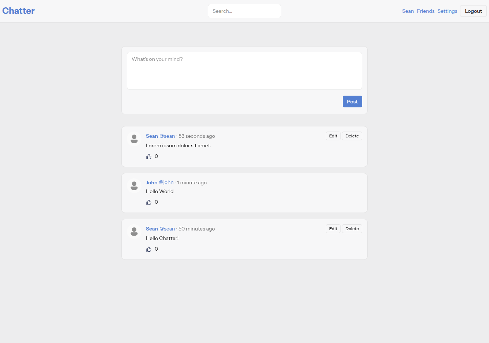

# Chatter

  

## About

Chatter is a social microblogging application based on Laravel Bootcamp's Chirper demo application. The application showcases modern Laravel development techniques including:

- Authentication and authorization
- Database migrations and Eloquent ORM
- Form validation and request handling
- Blade templating engine
- Tailwind CSS for styling
- Likes
- Friendship system

## Installation

1. Run `git clone https://github.com/smtack/chatter.git` and `cd chatter`
2. Run `composer install` then `npm install` to install dependencies
3. Run `cp .env.example .env` and customise for your database
4. Run `php artisan key:generate`
5. Run `php artisan migrate`
6. Run `composer run dev` to start the development server

To enable the default avatar, copy `default.png` from `public/images/` to `storage/app/public/avatars`, then run `php artisan storage:link`

## License

The Laravel framework is open-sourced software licensed under the [MIT license](https://opensource.org/licenses/MIT).
