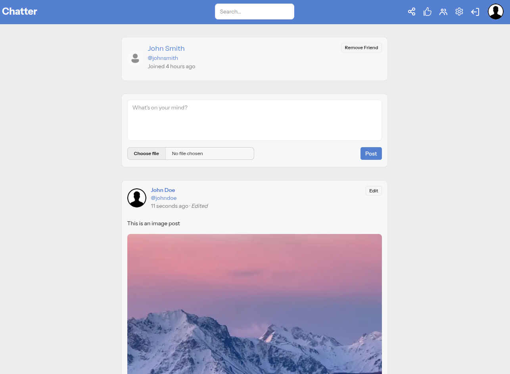

# Chatter

    

## About

Chatter is a social networking application originally based on Laravel Bootcamp's Chirper demo application. The application showcases modern Laravel development techniques including:

- Authentication and authorization
- Database migrations and Eloquent ORM
- Form validation and request handling
- Blade templating engine
- Tailwind CSS for styling
- Likes
- Friendship system

## Installation

1. Clone the repo and run `composer run setup`.
3. Run `mkdir -p storage/app/public/avatars storage/app/public/images && cp public/images/default.png storage/app/public/avatars/ && php artisan storage:link` to enable avatars and post images.
3. Run `composer run dev` to start the development server.

## License

The Laravel framework is open-sourced software licensed under the [MIT license](https://opensource.org/licenses/MIT).
